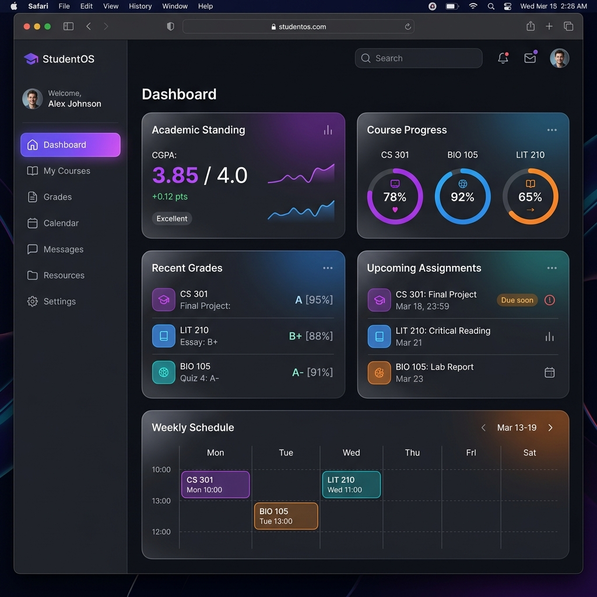
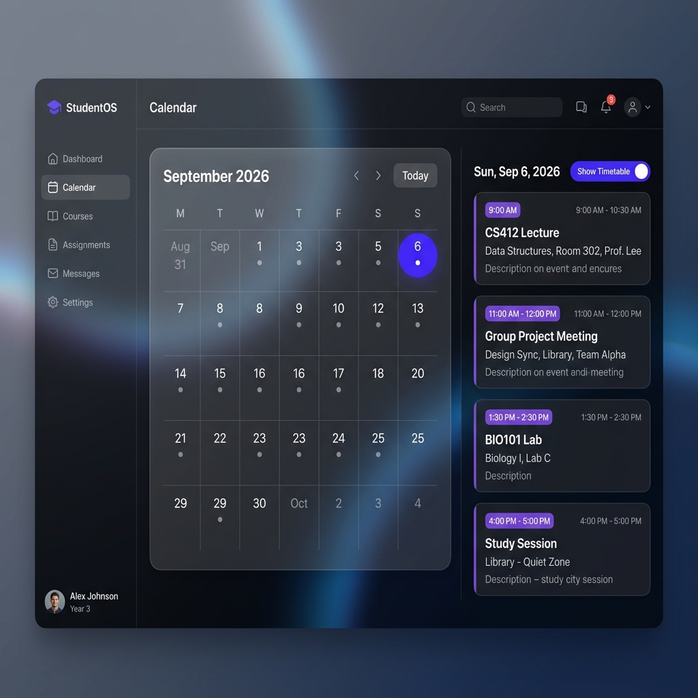
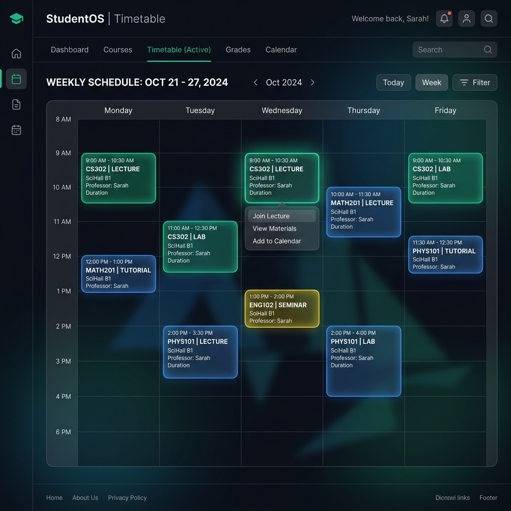

# StudentOS — The Ultimate Student Workspace

StudentOS is a modern, responsive, and feature-rich web portal designed to streamline university life. Built using **React**, **Vite**, **Framer Motion**, and **Tailwind CSS/Custom CSS**, it provides students with a single glassmorphic dashboard to track schedules, manage assignments, log grades, compute attendance, and study with an integrated AI companion.

---

## 📸 visual Previews

### 1. Home Dashboard


### 2. Interactive Calendar


### 3. Dynamic Course Timetable


---

## ✨ Features

### 📅 Calendar & Academic Planner
*   **Synced Timetable Integration**: Toggle class schedules inline directly under the date header using the new **"Show Timetable"** button, allowing the Month Highlights panel to expand dynamically.
*   **Holidays Registry**: Complete list of 2026 Gazetted and Restricted holidays automatically calculated and color-coded.
*   **Official Academic Planner**: Highlights registration days, course add/drop deadlines, exams, and vacations depending on the student's program (B.Tech, M.Tech, PhD).
*   **Custom Personal Events**: Add, color-code, edit, and delete personal reminders, deadlines, and exams.

### 🏫 Dynamic Course & Timetable Selector
*   **Semester Course Selection**: Pick from list of offered courses and see real-time credits summation.
*   **Conflict Detection**: Displays a clear visual warning when two selected course slots overlap.
*   **Customizable Slots**: Modify class times, room venues, session types (Lecture, Lab, Tutorial), or add custom slots.
*   **Multi-format Export**: Export your generated schedule to **Excel**, download as a high-res **PNG image**, or save as a **PDF**.

### 🤖 AI Study Companion
*   An intelligent chatbot equipped to explain complex concepts, summarize notes, generate flashcards, and guide students through assignments.

### 📊 Academics, Grades & Attendance Tracker
*   **Attendance Tracker**: Log attendance per class with warnings when attendance falls below the target threshold (e.g., 75%).
*   **GPA Planner**: Pre-plan and calculate grades, semester SGPA, and cumulative CGPA.
*   **Task Boards**: Dedicate sections to assignments, team projects, goals, and notes.

---

## 🛠️ Tech Stack

*   **Frontend Library:** React (Hooks, Context API, Suspense, Lazy Loading)
*   **Build Tool:** Vite
*   **Styling & Theme:** Custom CSS with Glassmorphism styles and responsive layouts + CSS Accent Presets (Indigo, Emerald, Purple, Orange, Pink, Blue)
*   **Iconography:** Lucide React
*   **Animations:** Framer Motion (page transitions and interactive accordion dropdowns)
*   **Libraries:** html2canvas, jsPDF, canvas-confetti

---

## 🚀 Setup & Installation

Follow these steps to run StudentOS locally:

1.  **Clone the Repository**:
    ```bash
    git clone https://github.com/destopianpirate/student_portal.git
    cd student_portal
    ```

2.  **Install Dependencies**:
    ```bash
    npm install
    ```

3.  **Configure Environment Variables**:
    Create a `.env` file at the root by duplicating `.env.example` and filling in Firebase keys (if applicable):
    ```bash
    cp .env.example .env
    ```

4.  **Run Development Server**:
    ```bash
    npm run dev
    ```
    Open `http://localhost:5173` in your browser.

---

## 🧑‍💻 Author

Built with ❤️ by **[destopianpirate](https://github.com/destopianpirate)**.
For contributions, bug requests, or feedback, please open a GitHub Issue or reach out.
