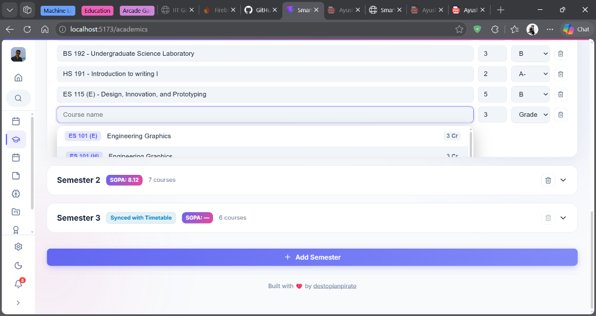

# 🎓 IITGN StudentOS

A premium, modern, and highly-optimized Student Portal dashboard built for **IIT Gandhinagar** students. Designed as a complete personal operating system for academic life, it helps track grades, schedules, projects, certificates, and focus sessions in one unified, visually stunning interface.



---

## ✨ Features

### 1. 📊 Academics & Grade Analytics
* **Two-Column Dashboard**: High-density view separating semesters from visual analytics for optimized screenspace.
* **11-Point Grading Scale**: Integrated support for the IITGN grading scale (A+=11, A=10, A-=9, B=8, B-=7, C=6, C-=5, D=4, E=2, F=0).
* **Cumulative GPA Baseline Chart**: SPI trends bar chart (gradient-filled) mapped against a dashed CGPA line. Clicking any bar expands and scrolls to the selected semester.
* **What-If CGPA Goal Forecaster**: Interactive target slider that calculates the future SPI required to achieve desired academic standing.
* **Academic Honors Standing**: Dynamic status badges (e.g. `🏆 Dean's List Elite`, `⭐ Distinction`) based on current CGPA.

### 2. 📅 Unified Calendar Dashboard
* **Content-Dense Sidebar**: Merges synced classes, holiday warnings, academic deadlines, exams, and multi-day academic periods into one right-column desktop sidebar.
* **Default Mount Schedule**: Automatically displays "Today's Agenda" on load, ensuring a populated dashboard immediately.
* **Clean Calendar Grid**: Highlights weekends, holidays, today's date, and custom events with colorful indicator dots.
* **Modal Event Creator**: Easily add personal, social, exam, quiz, or academic events with custom color tagging.

### 3. ⏰ Weekly Timetable Syncer
* **Registered Schedule Summary**: Automatically syncs active courses with a Monday-to-Friday schedule layout, showing weekly contact hours, class times, and venues.
* **Weekend Coffee Break Lock**: Automatically hides class lists on weekends, reminding you to take a break.

### 4. 🗂️ Portability & Data Export
* **IITGN Saffron-Theme PDF Exporter**: Redesigned PDF reporter containing full student profiles, segregated completed and running semesters, certificates, project lists, and digital ID card frames (Mess QR & Student ID).
* **College-Gated JSON Backups**: Allows exporting and importing of your entire profile backup file. Restricts loads if the imported backup's email doesn't match the active student.

### 5. 🛠️ Productive Study Tools
* **Study AI Helper**: Interactive chat assistant tailored to student questions.
* **Projects & Certificates Tracker**: Maintain and showcase academic projects and verified credentials.
* **Pomodoro Timer & Notes Grid**: Focus timers and sticky notes to stay organized during study sessions.

---

## 🛠️ Technology Stack

* **Frontend Framework**: [React.js](https://react.dev/) (via Vite)
* **Animations**: [Framer Motion](https://www.framer.com/motion/)
* **Icons**: [Lucide React](https://lucide.dev/)
* **Styling**: Modern CSS variables & HSL-curated responsive grid layouts
* **Libraries**: `html2canvas`, `jspdf` (for document exporting)

---

## 🚀 Getting Started

### Prerequisites
* [Node.js](https://nodejs.org/) (v16.0.0 or higher)
* [npm](https://www.npmjs.com/)

### Installation
1. Clone the repository:
   ```bash
   git clone https://github.com/destopianpirate/student_portal.git
   cd student_portal
   ```

2. Install dependencies:
   ```bash
   npm install
   ```

3. Run the local development server:
   ```bash
   npm run dev
   ```
   Open `http://localhost:5173` in your browser to view the application.

4. Build the production package:
   ```bash
   npm run build
   ```
   The compiled code will be saved in the `dist/` directory.

---

## ⚙️ Git Author Configuration

To ensure your commits are correctly attributed to your GitHub account and appear on your contribution graph, configure Git with your registered GitHub email address:

```bash
# Global configuration
git config --global user.email "your-github-email@domain.com"
git config --global user.name "Your Name"

# Local repository-only configuration
git config user.email "your-github-email@domain.com"
```

---

## 📄 License
This project is proprietary and customized for educational support at IIT Gandhinagar.
